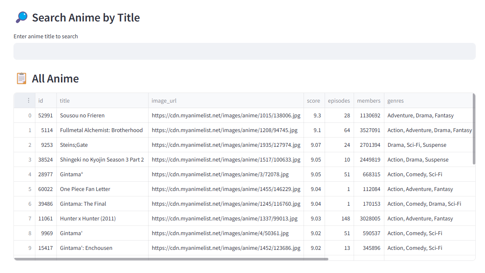
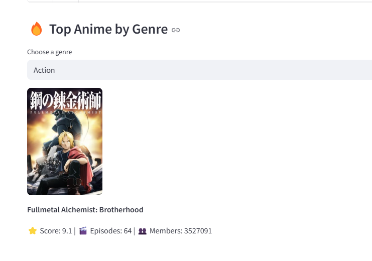
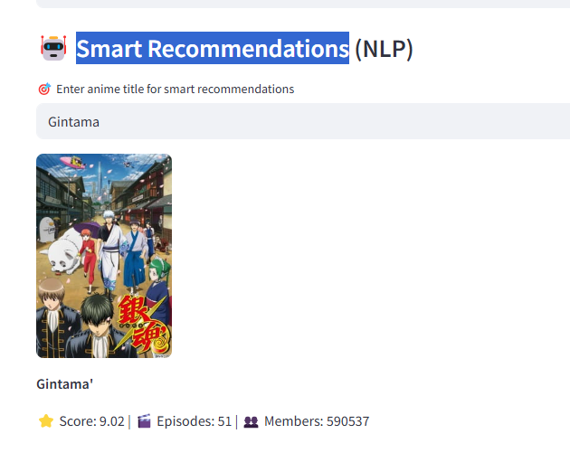
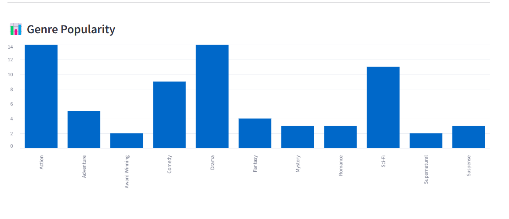

# مشروع توصية وتحليل بيانات الأنمي 🎌📊

مشروع بسيط واحترافي لتحليل بيانات الأنمي، يعتمد على استخراج البيانات من MyAnimeList (عبر Jikan API)، وتنظيمها في قاعدة بيانات SQL، ثم تحليلها وتقديم توصيات بناءً على النوع المفضل.

---


## 🎥 Screenshots

### 🔍 Anime Search


### 🔥 Top Anime by Genre


### 🤖 Smart Recommendations (TF-IDF)


### Genre Popularity

---

## 🎯 أهداف المشروع

- تطبيق عملي لخطوات الـ ETL (استخراج، تحويل، تحميل)
- استخدام SQL لتحليل البيانات
- عرض المهارات التقنية في Python وتنظيف البيانات والتعامل مع APIs
- إنشاء مشروع جاهز للعرض في ملف GitHub أو مقابلات العمل

---

## 🧰 التقنيات المستخدمة

- **Python** (يفضل 3.10 أو أحدث)
- **Jikan API** (مصدر البيانات)
- **Pandas** لتنظيف وتحليل البيانات
- **PostgreSQL + SQLAlchemy** للتخزين
- **Streamlit** للواجهة التفاعلية
- *(اختياري)*: Jupyter / matplotlib للعرض والتحليل الإضافي

---

## 📁 هيكل المشروع

```
anime-recommender-project/
├── etl/               # سكربتات استخراج وتحويل وتحميل البيانات
├── db/                # ملفات قاعدة البيانات أو الاتصال
├── analysis/          # ملفات التوصيات والتحليل
├── data/              # بيانات خام أو مؤقتة
├── output/            # نتائج التحليل أو الرسومات
├── main.py            # الملف الرئيسي لتشغيل ETL
├── app.py             # تطبيق Streamlit لعرض النتائج
├── requirements.txt   # مكتبات المشروع
├── .gitignore         # تجاهل الملفات الغير مهمة
└── README.md
```

---

## 🚀 طريقة التشغيل

1. تثبيت المكتبات المطلوبة:
   ```bash
   pip install -r requirements.txt
   ```

2. تشغيل ETL من الملف الرئيسي:
   ```bash
   python main.py
   ```

3. تشغيل واجهة Streamlit:
   ```bash
   streamlit run app.py
   ```


## 🤝 الرخصة

المشروع مفتوح المصدر تحت ترخيص MIT.
